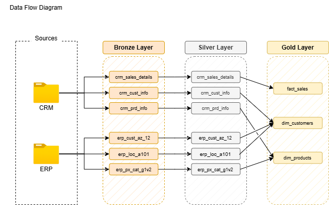

# SQL Data Warehouse & Sales Analytics Project

## Project Overview

This project demonstrates the design and implementation of an end-to-end SQL Server data warehouse using CRM and ERP sales data.

The project follows a **Bronze, Silver and Gold** data architecture. Raw CSV files are loaded into the Bronze layer, cleaned and standardised in the Silver layer, and transformed into business-ready views in the Gold layer.

The final Gold layer is modelled using a star schema and supports sales, customer and product analysis, including revenue trends, top-performing products, customer behaviour and product performance reporting.

---

## Business Problem

The business has customer, product and sales data spread across different source systems.

CRM data contains customer information, product details and sales transactions, while ERP data provides additional customer demographics, location data and product category information.

Before this data can be used for reporting or decision-making, it needs to be:

- Loaded from raw CSV files
- Cleaned and standardised
- Integrated across CRM and ERP systems
- Modelled into a structure suitable for analysis
- Prepared for business reporting and dashboarding

This project solves that problem by creating a structured SQL Server data warehouse that turns raw operational data into an analytics-ready Gold layer.

---

## Data Architecture

The project uses a three-layer data warehouse architecture:

| Layer | Purpose |
|---|---|
| Bronze | Stores raw CRM and ERP data loaded from CSV files |
| Silver | Cleans, standardises and prepares the data |
| Gold | Provides business-ready fact and dimension views for analysis |



---

## Source Data

The project uses two source systems:

| Source System | Description |
|---|---|
| CRM | Customer information, product information and sales transaction data |
| ERP | Customer demographics, customer location and product category data |

The raw data is stored in CSV format and loaded into SQL Server using `BULK INSERT`.

### CRM Source Files

```text
datasets/source_crm/
├── cust_info.csv
├── prd_info.csv
└── sales_details.csv
