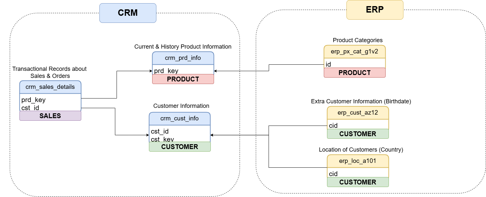
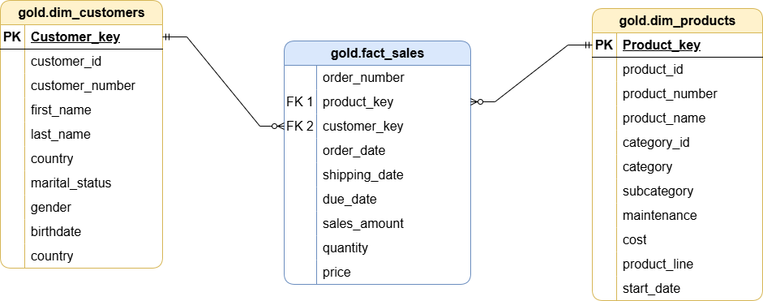

# SQL Data Warehouse & Sales Analytics Project

## Project Overview

This project demonstrates the design and implementation of an end-to-end SQL Server data warehouse using CRM and ERP sales data.

The project follows a **Bronze, Silver and Gold** data architecture. Raw CSV files are loaded into the Bronze layer, cleaned and standardised in the Silver layer, and transformed into business-ready views in the Gold layer.

The final Gold layer is modelled using a star schema and supports sales, customer and product analysis, including revenue trends, top-performing products, customer behaviour and product performance reporting.

---

## Business Problem

The business has customer, product and sales data spread across different source systems.

CRM data contains customer information, product details and sales transactions, while ERP data provides additional customer demographics, location data and product category information.

Before this data can be used for reporting or decision-making, it needs to be:

* Loaded from raw CSV files
* Cleaned and standardised
* Integrated across CRM and ERP systems
* Modelled into a structure suitable for analysis
* Prepared for business reporting and dashboarding

This project solves that problem by creating a structured SQL Server data warehouse that turns raw operational data into an analytics-ready Gold layer.

---

## Data Architecture

The project uses a three-layer data warehouse architecture:

| Layer  | Purpose                                                       |
| ------ | ------------------------------------------------------------- |
| Bronze | Stores raw CRM and ERP data loaded from CSV files             |
| Silver | Cleans, standardises and prepares the data                    |
| Gold   | Provides business-ready fact and dimension views for analysis |


---

## Source Data

The project uses two source systems:

| Source System | Description                                                          |
| ------------- | -------------------------------------------------------------------- |
| CRM           | Customer information, product information and sales transaction data |
| ERP           | Customer demographics, customer location and product category data   |

The raw data is stored in CSV format and loaded into SQL Server using `BULK INSERT`.

### CRM Source Files

```text
datasets/source_crm/
├── cust_info.csv
├── prd_info.csv
└── sales_details.csv
```

### ERP Source Files

```text
datasets/source_erp/
├── cust_az12.csv
├── loc_a101.csv
└── px_cat_g1v2.csv
```

---

## Source System Integration

The CRM and ERP datasets are integrated through customer, product and category keys. This allows the final Gold layer to combine transaction-level sales data with customer demographics, location information and product category details.



---

## Bronze Layer

The Bronze layer stores the raw source data exactly as it is loaded from CSV files.

This layer acts as the landing area for the data warehouse and keeps the original structure of the source systems.

Bronze tables include:

* `bronze.crm_cust_info`
* `bronze.crm_prd_info`
* `bronze.crm_sales_details`
* `bronze.erp_cust_az12`
* `bronze.erp_loc_a101`
* `bronze.erp_px_cat_g1v2`

The Bronze layer is created using:

```text
scripts/02_create_bronze_tables.sql
```

Data is loaded using:

```text
scripts/03_load_bronze_data.sql
```

---

## Silver Layer

The Silver layer stores cleaned and standardised data.

Key transformations include:

* Removing duplicate customer records
* Keeping the latest customer record
* Trimming unwanted spaces
* Standardising marital status values
* Standardising gender values
* Cleaning product keys and category IDs
* Replacing missing product costs
* Standardising product line values
* Converting numeric date fields into proper date formats
* Handling invalid or missing date values
* Correcting sales, quantity and price inconsistencies
* Standardising country names
* Cleaning ERP customer IDs for integration

Silver tables include:

* `silver.crm_cust_info`
* `silver.crm_prd_info`
* `silver.crm_sales_details`
* `silver.erp_cust_az12`
* `silver.erp_loc_a101`
* `silver.erp_px_cat_g1v2`

The Silver layer is created using:

```text
scripts/04_create_silver_tables.sql
```

The Bronze to Silver transformation is handled by:

```text
scripts/05_transform_bronze_to_silver.sql
```

---

## Gold Layer

The Gold layer contains business-ready views designed for analytics and reporting.

The data is modelled using a star schema with one fact view and two dimension views:

| View                 | Type           | Description                                        |
| -------------------- | -------------- | -------------------------------------------------- |
| `gold.fact_sales`    | Fact view      | Sales transactions, quantities, prices and dates   |
| `gold.dim_customers` | Dimension view | Customer details, demographics and location        |
| `gold.dim_product`   | Dimension view | Product details, categories and product attributes |



The Gold layer is created using:

```text
scripts/06_create_gold_views.sql
```

---

## Analysis Performed

The project includes SQL analysis across sales, customer and product performance.

### Sales Analysis

* Total sales
* Total quantity sold
* Average selling price
* Total number of orders
* Monthly sales trends
* Yearly sales trends
* Running total sales
* Moving average price

### Customer Analysis

* Total customers
* Customers by country
* Customers by gender
* Customers by marital status
* Top customers by revenue
* Customer order behaviour
* Customer recency analysis
* Revenue by country

### Product Analysis

* Total products
* Products by category
* Revenue by product category
* Revenue by product subcategory
* Top products by revenue
* Bottom products by revenue
* Product performance segmentation
* Product lifespan and recency
* Average order revenue
* Average monthly revenue

---

## Product Performance Report

A dedicated product performance report view is created in the Gold layer:

```text
gold.report_products
```

This report calculates product-level metrics including:

* Total sales
* Total orders
* Total quantity sold
* Total customers
* Average selling price
* Average order revenue
* Average monthly revenue
* Product lifespan
* Recency since last sale
* Product performance segment

Products are segmented into:

| Segment        | Logic                                 |
| -------------- | ------------------------------------- |
| High-Performer | Total sales above 50,000              |
| Mid-Range      | Total sales between 10,000 and 50,000 |
| Low-Performer  | Total sales below 10,000              |

The report script is located at:

```text
reports/product_performance_report.sql
```

---

## Repository Structure

```text
sql-data-warehouse-sales-analytics/
│
├── README.md
│
├── docs/
│   ├── data_architecture.png
│   ├── integration_model.png
│   └── star_schema_model.png
│
├── datasets/
│   ├── source_crm/
│   │   ├── cust_info.csv
│   │   ├── prd_info.csv
│   │   └── sales_details.csv
│   │
│   └── source_erp/
│       ├── cust_az12.csv
│       ├── loc_a101.csv
│       └── px_cat_g1v2.csv
│
├── scripts/
│   ├── 01_create_database.sql
│   ├── 02_create_bronze_tables.sql
│   ├── 03_load_bronze_data.sql
│   ├── 04_create_silver_tables.sql
│   ├── 05_transform_bronze_to_silver.sql
│   ├── 06_create_gold_views.sql
│   └── 07_business_analysis_queries.sql
│
├── reports/
│   ├── product_performance_report.sql
│   ├── sales_trend_analysis.sql
│   └── customer_analysis.sql
│
└── assets/
    └── portfolio-preview.png
```

---

## How to Run This Project

### 1. Clone the repository

```bash
git clone https://github.com/aqeel-shahzad/sql-data-warehouse-sales-analytics.git
```

### 2. Open the project in SQL Server Management Studio

Open SQL Server Management Studio and connect to your SQL Server instance.

### 3. Update the dataset file paths

Before loading the Bronze layer, update the file paths inside:

```text
scripts/03_load_bronze_data.sql
```

Replace the placeholder path:

```sql
C:\path\to\sql-data-warehouse-sales-analytics\
```

with the actual location of the project folder on your machine.

### 4. Run the scripts in order

Run the scripts in this order:

```text
01_create_database.sql
02_create_bronze_tables.sql
03_load_bronze_data.sql
04_create_silver_tables.sql
05_transform_bronze_to_silver.sql
06_create_gold_views.sql
07_business_analysis_queries.sql
```

### 5. Run the report scripts

After the Gold layer is created, run the report scripts:

```text
reports/product_performance_report.sql
reports/sales_trend_analysis.sql
reports/customer_analysis.sql
```

---

## Tools Used

* SQL Server
* T-SQL
* SQL Server Management Studio
* CSV files
* Draw.io for data architecture and modelling diagrams
* GitHub for version control and portfolio presentation

---

## Skills Demonstrated

This project demonstrates:

* SQL Server database development
* T-SQL scripting
* Data warehouse design
* Bronze, Silver and Gold architecture
* ETL development
* Data cleaning and standardisation
* CRM and ERP data integration
* Star schema modelling
* Fact and dimension view creation
* SQL views
* Window functions
* Aggregations
* Joins
* Business analysis using SQL
* Sales analysis
* Customer analysis
* Product performance analysis
* Report query design
* GitHub project documentation

---

## Project Outcome

The final output is a structured SQL Server data warehouse that transforms raw CRM and ERP data into a clean analytics-ready model.

The Gold layer enables business users and analysts to explore sales performance, customer behaviour and product trends using reliable, standardised data.

This project shows how raw operational data can be turned into a trusted reporting layer for business decision-making.

---

## Portfolio Summary

Built an end-to-end SQL Server data warehouse using CRM and ERP sales data. Designed Bronze, Silver and Gold layers, cleaned and standardised raw data, created a star schema with fact and dimension views, and wrote SQL queries to analyse sales, customers and product performance.
